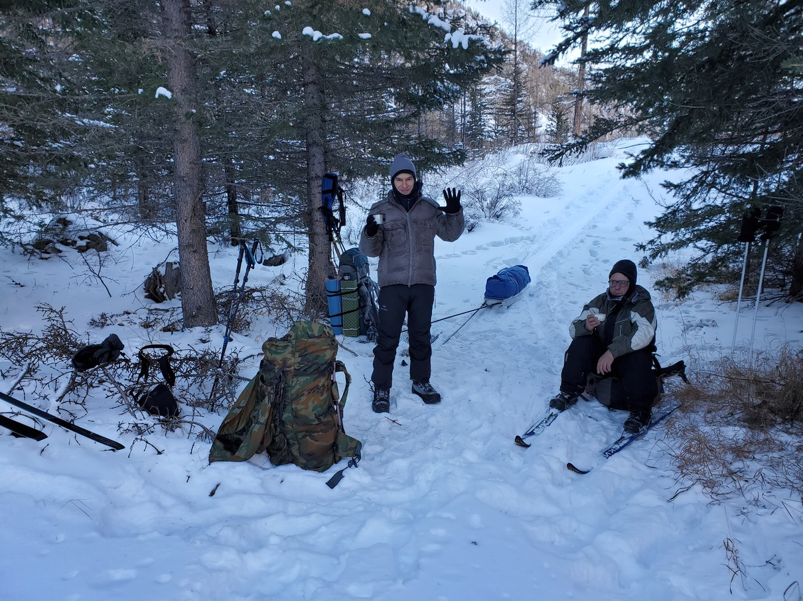

Алтай, район Кош-Агача (2022.01.02--09)
=======================================
Andrew <adrianopol@gmail.com>
:toc:

//TODO
// set russian quotation marks
//:ldquo: &#8222;
//:rdquo: &#8220;
//{set:ldquo:&laquo;}
//{set:rdquo:&raquo;}

// Set caption for figures for the rest of the document to empty string.
:figure-caption:

link:index.html[На главную]

Поездка на других ресурсах: https://www.komoot.com/tour/639725679[komoot].

== Рассказ ==

Серёга с батей решили повторить прошлогодние https://sebram.livejournal.com/75379.html[приключения на Алтае] и снова
собрались провести в тех местах новогодние каникулы. Я до последнего не знал, получится и стоит ли идти с ними или нет,
но в итоге решился, купил билеты на самолёт, хоть и вдвое дороже их первоначальной стоимости, и начал запасаться
снаряжением. Собственно, докупить надо было только кое-что из обуви и одежды, т.к. планировалось рассчитывать на
выживание при температуре до -50 C°, а в этом случае стоит иметь запас качественных слоёв с низкой теплопроводностью.

.Точка старта у Чуйского тракта. Оказалось, что у Серёгиной лыжи в самолёте погнули крепление. Крепление, Карл!
image:img/altai/20220102_165535.jpg[]

2-го января, прилетев утром в Горно-Алтайск, мы сразу встретили нашего водителя, загрузились и отправились в дорогу.
Расстояние, казалось бы небольшое (~420 км), но из-за частых серпантинов и поворотов, а также перерыва на обед, в дороге
пришлось провести больше 5 часов. На место -- в район турбазы Куйактанар на Чуйском тракте -- приехали уже близко к
закату, разложили лыжи, перепаковали рюкзаки, переоделись потеплее и отправились искать место первой ночёвки.

.Мостик через микроречку

Где-то через полчаса встали около пустых жилых домов, которые в тёплый период принимают гостей. Серёга занялся палаткой
и раскладушками, а мы с Сергеем Иванычем пошли искать деревья для дров и оснований раскладушек. Это была, пожалуй, самая
холодная ночь -- -23 C° -- хотя нас такая температура не заботила, даже наоборот стало немного жалко, что тёплая и
сложная экипировка так и не сыграла своей роли.

.На хороших дровах бока и труба печи раскалялись до красна, отдавая много тепла за короткое время
image:img/altai/20220102_234947.jpg[]

.Утренние сборы. Собирались каждый раз долго, несколько часов, выходили, когда уже было совсем светло

.После сборов. Остатки углей и дров сжигали на улице в костре
image:img/altai/20220103_085200.jpg[]

Утром глянули карту и пошли дальше по маршруту -- удаляться от тракта в сторону гор.  Весь второй и третий день мы будем
почти всё время подниматься вверх. Тут мы сразу ощутили решающее значение камусов. Я до этого похода не знал, что это
такое, но на всякий случай по совету Серёги купил их. Оказалось, с ними можно тащить и рюкзак (18 кг) и сани (25--30 кг)
в уклон до 30 градусов. В общем, всю дорогу в горку с санями шлось довольно комфортно.

image:img/altai/20220103_101933.jpg[]

.Спиленное и поваленное дерево выросло снова
image:img/altai/20220103_100952.jpg[]

.Привал -- время перевести дух, выпить чайку, рассказать анекдот

image:img/altai/20220103_104903.jpg[]

.Ваш покорный
image:img/altai/20220103_105243.jpg[]

.Серёга и Сергей Иваныч протопили лыжню -- идти по ней намного легче
image:img/altai/20220103_110050.jpg[]

.Подъём через поле колючих и не очень кустарников
image:img/altai/20220103_113603.jpg[]

.Видны короткие камусы на лыжах Серёги, один из которых скоро безвозвратно потеряется

Изначально мы планировали идти по протоптанной животными тропе, но вскоре потеряли её и пошли по усеянному мелкими
кустарниками склону: двое шли впереди и тропили дорогу, а я -- за ними. В итоге уперлись в густые заросли и морены,
прямо перед которыми Серёга потерял один из камусов (у него были короткие, крепящиеся через прорези в лыже, в итоге при
ходьбе они не на виду). Так и не найдя его, осмотревшись, мы решили перейти через камни на правую сторону подъёма, чтобы
идти дальше. Переходить по камням было довольно стрёмно и я даже никак не мог решить, идти ли на лыжах или пешком. Но
рельеф всё-таки был такой, что я выбрал второй вариант. Опасность, собственно, в том, чтоб под снегом совершенно не
видно ни наличие камней, ни их форма. В итоге палки при втыкании их в снеговой холмик могут встать крепко, могут
провалиться в куст, могут попасть на скос камня и соскочить в расщелину глубиной до пары метров. Как Серёга умудрился
перенести на спине по этой части почти 30-ти килограммовые сани и всё их содержимое, для меня осталось загадкой.

.Морена

.Морена между двумя грядами гор
image:img/altai/20220103_142701.jpg[]

.Серёга тащит сани и всё их содержимое
image:img/altai/20220103_142842.jpg[]

Перебравшись, мы перекусили и стали подниматься в крутую горку. Причём горка была настолько крутая, что на одном из
поворотов при подъёме траверсом я упёрся санями и их дугами и отстегнул их, чтобы поднять рюкзак и сани отдельно в 2
ходки. Где-то там же ещё и упал (падений вообще было немало на всём маршруте), погнул лыжную палку, изрядно выругался и
пошёл дальше. :)

image:img/altai/20220103_163101.jpg[]

.Край холма около лагеря

.Собираем палатку
image:img/altai/20220103_172114.jpg[]

Кстати, про перекусы: у нас были запланированы 3--4 приёма пищи, не считая полноценных завтрака и ужина: орехи, шоколад,
бутерброды с маслом и сыром (в виде сэндвичей), сало, сыровяленая колбаса. Отмечу, что на таком морозе проблемно есть
почти всё, из жидкостей у нас не замерзал только спирт, который Сергей Иваныч активно использовал для лечения,
расслабления и всех прочих целей, а я берёг для дезинфекции и на самый крайний случай. :) Почти вся перечисленная еда
была мало отличима по твёрдости от камня, теряя также часть вкусовых качеств. Если бутерброды ещё можно было кусать и
жевать, то с колбасой было совсем печально. Я сначала ленился и резал её на 3 большие порции, но жевать или откусывать
их оказывалось совсем нереально. Потом уже резал каждую порцию на мелкие части.

На следующий день мы пошли в сторону Куектанарских озёр, в конце которых в итоге и встали. Шли почему-то по сложному
рельефу горы, а не по озеру, возможно, Серёга хотел пройти дальше и встать ближе к перевалу. По пути было несколько
сложных крутых подъёмов, где пришлось изрядно попотеть. Двое других сильно оторвались от меня, и обнаружились уже на
озере, когда я спускался. Спуски тогда стали круче, и на одном из них я резко наехал лыжей на камень, порвав один камус.
Лыжи у меня и с камусами уже начали сильно скользить, так что оставшийся спуск решил пройти уже пешком. Кстати, всю
дорогу я напевал чуть изменённую песню Высоцкого «Парус»: «Камус, порвали камус! Каюсь, каюсь, каюсь!» В итоге так и
получилось, не выдержала резинка натяжителя на мыске. Хорошо, что это произошло перед местом, где мы решили провести 2
днёвки (маршрут уже на второй день решили сильно сократить из-за более тяжёлого рельефа, чем планировалось).

.Привал
image:img/altai/20220104_110638.jpg[]

.Таких колючек было довольно много на протяжении всего подъёма
image:img/altai/20220104_120326.jpg[]

.Штурмую крутую горку
image:img/altai/20220104_121711.jpg[]

.Следы зверя
image:img/altai/20220104_124818.jpg[]

.Серёга оценивает дальнейшие направления
image:img/altai/20220104_130943.jpg[]

.Идём к озеру

.Самое время погреться

image:img/altai/20220104_142221.jpg[]

image:img/altai/20220104_142316.jpg[]

image:img/altai/20220104_150044.jpg[]

.Мелкий зверь

.Идём вдоль озера
image:img/altai/20220104_162841.jpg[]

image:img/altai/20220104_163059.jpg[]

.Серёга вернулся помочь и взял мой рюкзак. Скоро я с санями разгонюсь и порву натяжитель камуса об камень
image:img/altai/20220104_163755.jpg[]

.На озере

В тот вечер приключения не кончились: встали мы довольно поздно, солнце уже зашло, начало стремительно темнеть. Сергей,
как обычно, занялся палаткой, мы -- дровами. Дрова было видно уже плохо, кроме того, весь лес был выше нашего уровня
(т.к. мы стояли всего чуть выше поверхности озера), а сугробы там были больше метра глубиной. В общем, ходить и искать
было тем ещё удовольствием. Уже ночью мы с Сергеем Иванычем стали распиливать полуповаленное дерево, но оно в итоге
оказалось сильно отсыревшим, отчего вода в печном котле не закипала до начала 5 часов утра. Я тогда уже чуток
переохладился и стал подмерзать. Но в итоге мы смогли поесть и согреться, а в следующие дни с дровами проблем уже не
было.

К полудню следующего дня полегчало, Сергей пошёл подниматься и тропить дорогу к перевалу, а мы занялись дровами. К
вечеру мы принялись латать инвентарь: я починил камус парой сшитых в кольца отрезков нейлоновой стропы, любезно
предоставленной Сергеем Иванычем. В итоге стало даже надёжнее, чем было.

.Сергей собирается искать дорогу к перевалу, а мы с Сергей Иванычем -- искать и заготавливать дрова

.Разные ракурсы с места стоянки
image:img/altai/20220105_123138.jpg[]

image:img/altai/20220105_152239.jpg[]

image:img/altai/20220105_164226.jpg[]

image:img/altai/20220105_164239.jpg[]

Немного про палаточный быт: хоть палатка и большая, находиться в ней втроём оказалось впритык, если расставлять спальные
места по периметру. Места хватило на 2 Серёгины раскладушки, мой лежак с двумя пенками на снегу, место следящего за
костром и дровяник. Ещё была небольшая пенка под вещами, на которой также можно было сидеть, т.к. на раскладушках сидеть
было крайне нежелательно. Вообще, я так и не понял их целевое предназначение: площадь ножек крайне мала, ножек много и
они требуют под собой ровной поверхности, в любой грунт будут проваливаться под давлением. Сергей их немного
модифицировал, заказав из фанеры накладки с углублениями под продольные брёвна. В итоге на каждую раскладушку
требовалось найти и напилить около 6 метров ровных стволов, сделать пропилы в нужных местах, разместить всё это на
снегу. Как по мне, то это слишком напряжно и несоразмерно комфорту, если только не стоять на одном месте несколько дней
подряд. Благо, что мы шли назад тем же путём и переиспользовали заготовленные ранее брёвна для лежаков. У меня это пока
был самый холодный поход из всех, но за счёт печки в большой палатке спалось намного комфортнее, чем в прошлых походах,
когда температура была -12..-7 градусов, лицо подмёрзло только один раз за все дни, снизу холод вообще почти не
чувствовался. Под куполом палатки Сергей вешал свои треккинговые палки, к которым мы прищепками крепили всё, что хоть
немного набирало влагу. Там порой была температура выше +20 C°. Инея в палатке почти не было, обычно небольшой его слой
заканчивался на уровне около 30 см от уровня снега.

.Сушилка
image:img/altai/20220105_220536.small.jpg[]

.Моё место отдыха

.Обсуждаем всякие максимально неполиткорректные темы

.Время работы: тихо сижу и починяю свой камус, Сергей Иваныч -- сидушку, а Серёга лёг отсыпаться
image:img/altai/20220105_223643.small.jpg[]

image:img/altai/20220105_224321.small.jpg[]

image:img/altai/20220106_083306.small.jpg[]

image:img/altai/20220106_095817.small.jpg[]

image:img/altai/20220106_100042.small.jpg[]

Во вторую днёвку мы с Сергеем Иванычем решили сходить по следам Серёги на перевал и хоть краем глаза увидеть долину
между двумя грядами гор. Подниматься было довольно сложно, где-то -- лесенкой. Уже выйдя из леса, мы встретили
возвращающегося обратно Серёгу, успевшего пофоткать местные ландшафты, а сами пошли в краю седловины. Там тоже
поснимали, перевели дух, Сергей Иваныч увидел  на соседнем пригорке что-то типа стаи волков, остановившихся посмотреть
на него и пошедших дальше. И двинулись обратно. Но даже не дойдя до леса я понял, что эти камусы совсем меня не тормозят.
Упав несколько раз, решил все крутые спуски идти лесенкой. Идти пешком бы не получилось, т.к. в большинстве мест нога в
снег проваливалась, причём проваливалась минимум по колено. Сергей Иваныч ещё в начале спуска сказал мне, что Серёга
спокойно спускался вообще без камусов и верёвочных зацепов, и всю оставшуюся дорогу назад я думал, что выскажу ему на
это и как буду боготворить Серёгу, если он действительно спустился на лыжах без тормозов. :) Спуск заканчивать пришлось
уже после заката, и я тогда подумал, что был дураком, выложив фонарик из рюкзака, идя в эту радиалку. Но в конце концов,
дошёл.

.Топим
image:img/altai/20220106_100100.jpg[]

.Привёз дрова
image:img/altai/20220106_104630.jpg[]

.Взбираемся на гору
image:img/altai/20220106_120300.jpg[]

.Встретили Серёгу

image:img/altai/20220106_133908.jpg[]

.Вид назад, к озёрам
image:img/altai/20220106_134738.jpg[]

.Ушедший вперёд Сергей Иваныч

.Долина, откуда пришли
image:img/altai/20220106_142151.jpg[]

.Наст
image:img/altai/20220106_142620.jpg[]

image:img/altai/20220106_143240.jpg[]

image:img/altai/20220106_143740.jpg[]

.Идём обратно
image:img/altai/20220106_151212.jpg[]

Возвращаюсь такой с горы в лагерь и говорю: «Джентльмены, у меня для вас две новости: хорошая и плохая. Хорошая в том, что
камус-таки работает. Плохая же -- что он, собака, работает только в одну сторону!» Джентльмены ухмыльнулись, Серёга
подтвердил, что шёл всё-таки на тормозах, и я понял, что без таких же тормозов физически назад вернуться не смогу. Тогда
вечером Сергей Иваныч предложил мне ещё остаток нейлонового каната (~10 мм), который Серёга показал как связать в кольцо
самозатягивающимся узлом (grapevine knot, двойной рыбацкий). Надев два таких кольца на лыжи, обратно шлось уже сильно
увереннее (хотя и не так просто, как в горку, как ни странно).

.Серёга сфотографировал Сергея Иваныча, идущего забирать остатки дров

.Наконец-то, и я спустился
image:img/altai/20220106_172758.jpg[]

image:img/altai/20220106_172838.jpg[]

image:img/altai/20220106_174831.jpg[]

Возвращаться мы решили уже по озёрам, где идти было неисоизмеримо легче, чем по горе. Вышли к старой лыжне, идущей через
морены, в конце которой были какие-то странные следы от ботинок. Я сначала подумал, что это Серёга ходил на разведку 3
дня назад, но потом рядом с ними разглядели следы копыт и сделали вывод, что за нами всё дорогу шёл какой-то конный
всадник. Видимо, пожалев лошадь, он развернулся у морены и пошёл обратно. Следы его шли прям до места нашего старта. В
два последних дня сани уже тащил Серёга, и я удивился, как он с ними так легко шёл с учётом всех крутых спусков и
поворотов. Часто не получалось его догнать.

.Наледь со снеговыми узорами
image:img/altai/20220107_092931.jpg[]

.Тормоза на лыжах Сергея Иваныча

.Идём обратно, но уже по озеру
image:img/altai/20220107_122103.jpg[]

.В тех местах немало таких причудливых деревьев

image:img/altai/20220107_140045.jpg[]

.Глубина снега
image:img/altai/20220107_141435.jpg[]

.Лыжи Серёги
image:img/altai/20220107_154225.jpg[]

image:img/altai/20220107_185931.jpg[]

image:img/altai/20220108_093526.small.jpg[]

image:img/altai/20220108_100839.jpg[]

.Последние сборы
image:img/altai/20220108_121715.jpg[]

image:img/altai/20220108_122709.jpg[]

image:img/altai/20220108_141649.jpg[]

image:img/altai/20220108_141843.jpg[]

image:img/altai/20220108_141917.jpg[]

image:img/altai/20220108_155023.jpg[]

image:img/altai/20220108_163711.jpg[]

Выйдя к Чуйскому тракту, мы дождались водителя и по пути к гостинице решили отдать ему все сигнальные патроны, которые
он купил и передал нам в начале маршрута, потому что они так и не понадобились.

== Снаряга ==

Моё:

* ботики Hanwag Abisko GTX
* лыжи «НЛФ», палки обычные, не телескопические
* камусы Asnes Colltex 60X2100 Mix Endhook
* коврики: обычный из «Декатлона» и гармошка Splav Flex Track (без алюминиевого напыления)
* термобельё (без утепления), 2 флисовые кофты
  пуховая жилетка Quechua и пуховая куртка Splav Loretan (стоянки); лёгкая мембранная куртка (ходьба); горнолыжные
  брюки «Снаряжение», флисовые и термокальсоны (стоянки); балаклава
* треккинговые носки разной толщины
* чуни Splav «Aleut»
* 4 пары тонких флисовых перчаток, толстые перчатки с ветрозащитой, тёплые варежки Sivera «Алеут» (практически, не
  использовались), 2 пары строительных рукавиц (тонкие и брезентовые)
* спальник Splav Adventure Comfort (-1..-7 C°)
* прозрачные очки от ветра (не понадобились)

Серёга:

* ботинки те же
* лыжи Asnes Ingstad BC Waxless
* 2 раскладушки Therm-a-Rest Luxurylite Ultralite Cot
* коврик Therm-a-Rest Ridgerest Solite Large
* спутниковый телефон
* сани Savotta Paljakka Ahkio
* палатка Tentipi Safir 9
* екатеринбургская титановая печь с отделением под котлы + 2 титановых котла для неё

[NOTE]
====
[small silver]__Всё оригинальное содержимое этой страницы доступно без каких-либо ограничений как
относящееся к https://creativecommons.org/publicdomain/mark/1.0/[общественному достоянию]. +
All original content of this page is in the
https://creativecommons.org/publicdomain/mark/1.0/[public domain]. No rights reserved.__
====

// comments: discus.com
++++

<noscript>Please enable JavaScript to view the
<a href="https://disqus.com/?ref_noscript">comments powered by Disqus.</a></noscript>
++++
