Оленегорск--Ревда--Умбозеро--Апатиты (2018.10.15--20)
=====================================================
Andrew <adrianopol@gmail.com>
:toc:

//TODO
// set russian quotation marks
//:ldquo: &#8222;
//:rdquo: &#8220;
//{set:ldquo:&laquo;}
//{set:rdquo:&raquo;}

// Set caption for figures for the rest of the document to empty string.
:figure-caption:

link:index.html[На главную]

Поездка на других ресурсах: https://www.komoot.com/tour/305979843[komoot],
http://veloradar.ru/map/?track_id=rhtgos[veloradar], https://www.strava.com/activities/1925171219[strava].

image:img/umb/20181015_085518.jpg[]

[quote.epigraph]
[перед большой лужей] «Ну, что, где будем обходить: слева или справа?»

Блуждая в раздумьях, как бы пересечься с Виктором и приехать в Питер, он, со своей стороны, устал
меня ждать и предложил заманчивый вариант проехаться по Кольскому полуострову на велах. Т.к. поездка
предполагалась в местах с минимальной плотностью населения на квадратный км, автор без раздумий
согласился, не предполагая ещё истинных намерений товарища, но об этом позже. По поводу отпуска
получилось договориться только с середины октября. Время позднее и холодное для тех мест, золотая
осень, как выяснилось, уже прошла, но тут уж ничего не поделаешь.

В Питере остановились в его квартире (которая заслуживает отдельного рассказа), всё упаковали,
перепроверили и утром следующего дня поехали на вокзал. Дальнейшие сутки мы провели в поезде, где
время тянулось очень медленно; даже не представляю, как люди могут ехать так несколько дней подряд.
Зато прогулялись туда–сюда по составу и увидели интересный забугорный вагон.

.Новый немецкий вагон (СВ, кажется), в котором, однако, крайне неудобно для проводников открываются двери.
image:img/umb/20181014_191255.jpg[]

== День 1 ==

В 10 утра приехали в Оленегорск -- старт маршрута. План был поехать на восток до Ревды, пересечь
восточную часть гор Ловозёрские тундры, обогнуть Умбозеро, сделать приличный крюк через Хибины и,
наконец, мимо Кировска вернуться в Апатиты.

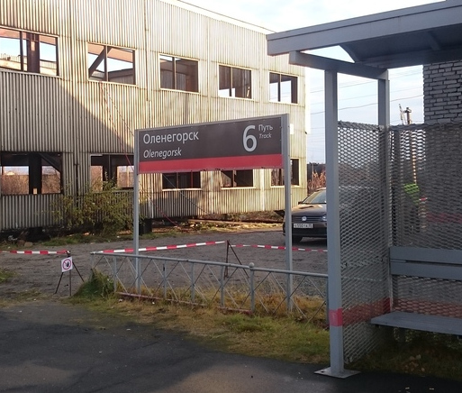

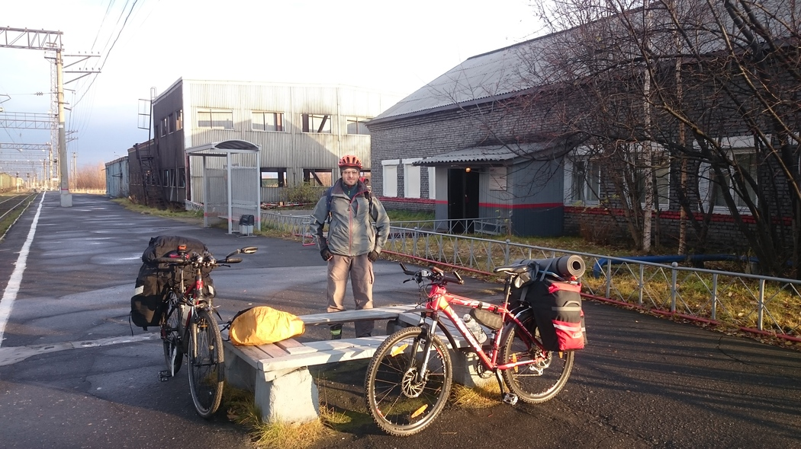

Весь первый день мы ехали по идеально ровному асфальту, видимо, характерному для северо-запада
России, имея цель максимально приблизиться к более сложным участкам. Тогда уже поняли, что такое
короткий северный день, когда в 15 часов солнце уже прячется за горами и облаками. Ценой усталости
от небольшого дождя, ветра, холода и окончания отрезка поездкой в полной темноте мы-таки преодолели
почти 80 км и остановились перед горой у реки Рослак, заскочив в Ревде в продуктовый магазин вопреки
презрительным взглядам Виктора. В городе один прохожий внезапно выразительно крикнул нам: «Парни!
Зачем вам это надо?!!!». Мы тогда ещё не знали, что тот имел в виду, и восприняли слова больше как
шутку... В кромешной темноте проехали город и приблизились к подножью горы, где перешли реку Рослак
и разбили лагерь.

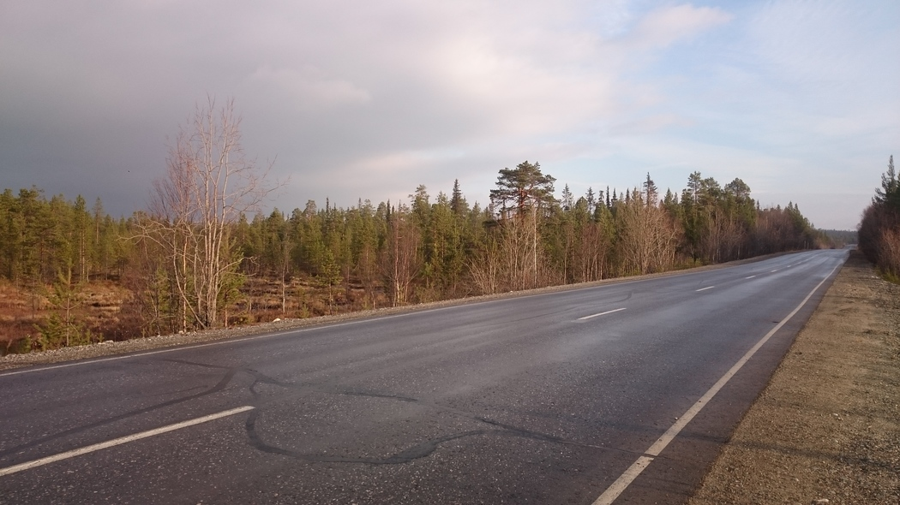

image:img/umb/20181015_131935.jpg[]

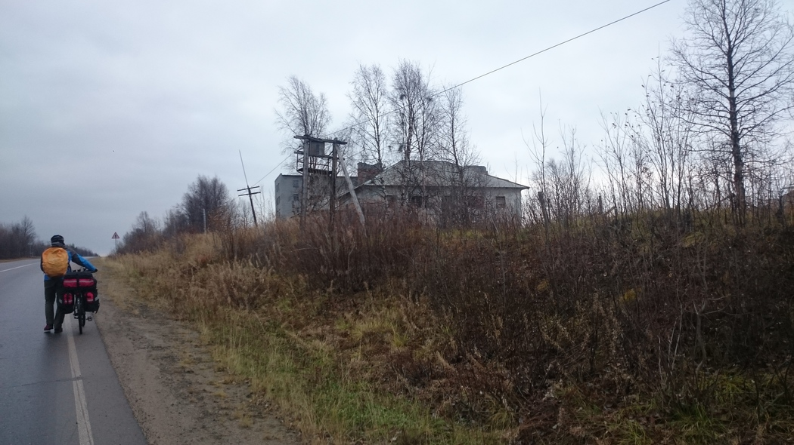

Немного про еду. Выяснили, что два котелка -- на 1.2 л и 1.8 л -- как раз идеальное сочетание для
приготовления еды и воды на двоих соответственно, хотя для еды можно было бы что-то побольше. Воду в
дороге пили только из термосов, во флягах она часто замерзала, одна -- так вообще треснула на морозе.
Готовили исключительно на газу, кроме утра третьего дня (об этом -- ниже), две первые готовки была
тушёнка, остальные -- сублимированное мясо с одним лишь недостатком: отсутствие жира, так нужного в
холодное время. В качестве перекусов были сыр и грудинка в сочетании с поджаренными в тостере
ржаными краюшками.

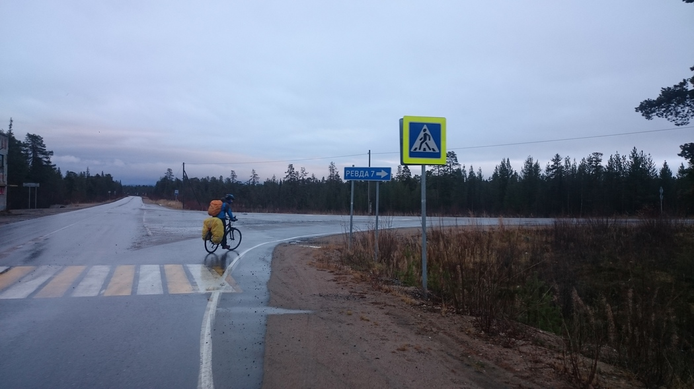

image:img/umb/20181015_162010.jpg[]

== День 2 ==

.Утро у подножъя горы (после Ревды)
image:img/umb/20181016_073038.jpg[]

image:img/umb/20181016_073716.jpg[]

Утром встали пораньше, часов в 5, чтобы успеть выйти на рассвете и максимально использовать световой
день (в 17:30 уже были сумерки, в 18 ехать представлялась возможность исключительно с фонарём).
Вдали разглядели ехавшую к какому-то комбинату раннюю «буханку», и стали подниматься в гору:
следующие 3 дня уже не увидим никаких людей. Ехать стало тяжело после первого десятка метров,
пришлось спешиться.

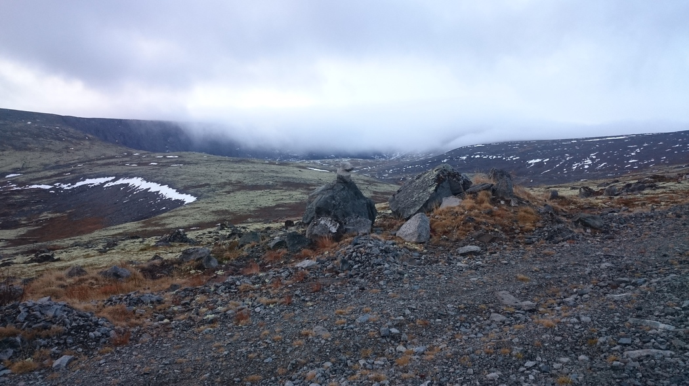

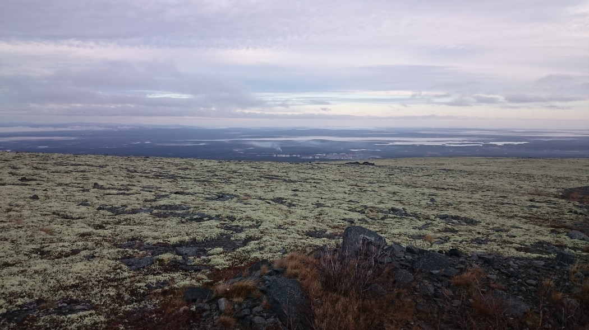

.Дорога прямо как в Мордоре :)
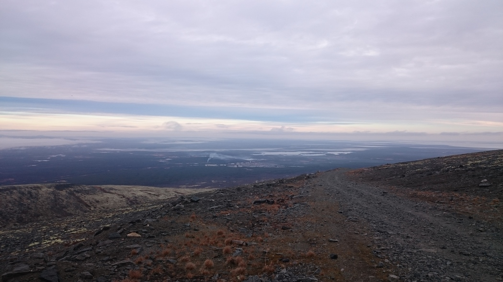

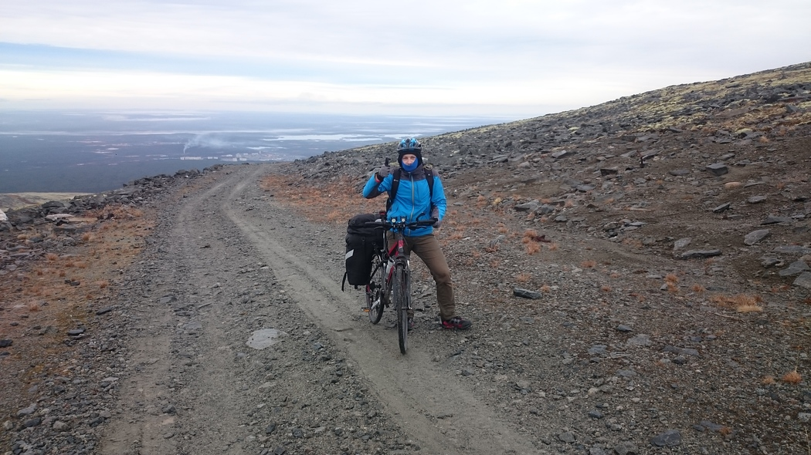

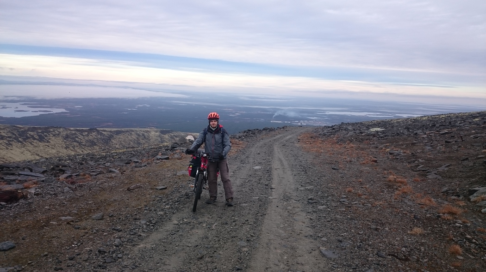

image:img/umb/20181016_094644.jpg[]

По мере подъёма становилось холоднее; сала у нас с собой не было, зато жирная грудинка с
подсушенными в тостере ржаными краюшками согревала и придавала энергии. Ещё замечательно шли
высушенные на солнце дачные яблоки, которые от мороза стали ещё и хрустящими. Мы прошли пару слоёв
облаков, увидели вчерашнюю Ревду, снега и льда становилось всё больше.

image:img/umb/20181016_101213.jpg[]

image:img/umb/20181016_105340.jpg[]

.Туристы на той дороге часто развлекались :)
image:img/umb/20181016_110448.jpg[]

.Чем выше к вершине, тем меньше всякой растительности
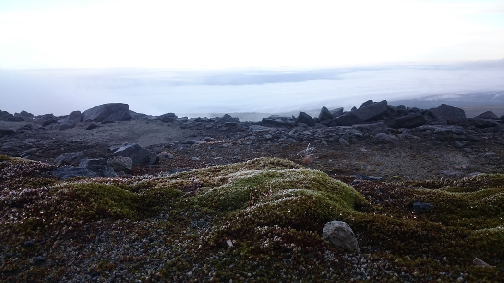

.Постоянно меняющиеся пейзажи с разноуровневыми слоями облаков
image:img/umb/20181016_111855.jpg[]

.Покрытые льдом растения. И ягель, конечно
image:img/umb/20181016_112137.jpg[]

.«Призадуматься и присмотреться...»
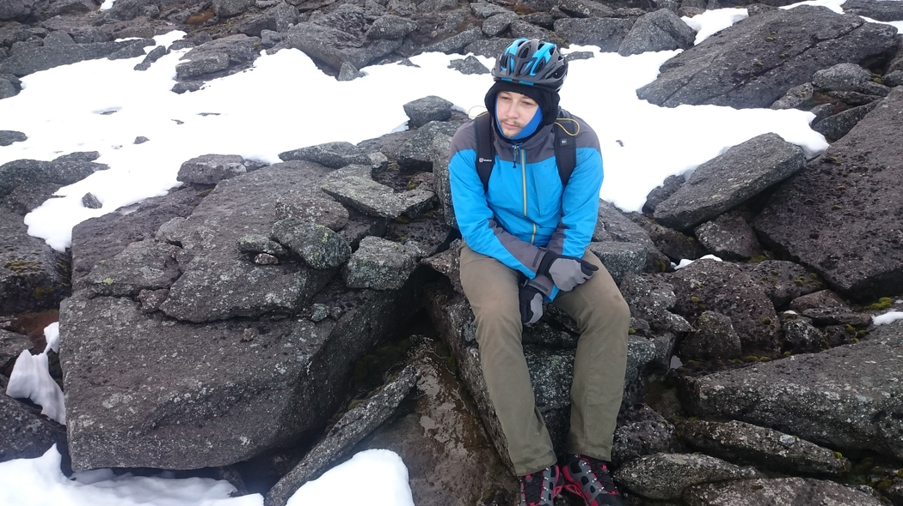

image:img/umb/20181016_112340.jpg[]

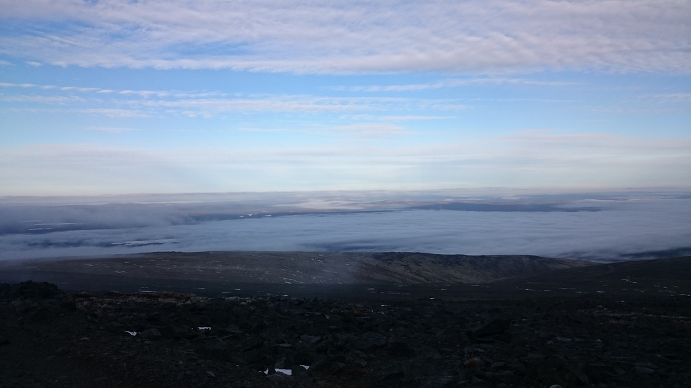

Так поднялись на гору Аллуайв и увидели интересные пейзажи из множества острых чёрных камней,
покрытых редким лишайником, перемежающихся со снегом. Где-то между камней слышались горные ручьи,
туман сгущался, и в итоге мы дошли по дороге до самой вершины.

image:img/umb/20181016_114223.jpg[]

Планы в этот день были проехать 50 км, из которых мы за полдня прошли всего лишь около 5--7, сели на
велы и решили нагонять. Погода на вершине быстро менялась: густой туман за пару минут сменялся ясным
солнечным небом, от чего становилось теплее и веселее.

.Густой туман...
image:img/umb/20181016_115920.jpg[]

.\... и через 5 минут -- ясное небо
image:img/umb/20181016_121428.jpg[]

Но проехав несколько сотен метров в районе перевала Геологов, туман вновь поглотил нас, а к нему
добавилась ещё более важная проблема: подмороженный сверху снег покрывал почти всю дорогу, идти по
нему было в основном довольно комфортно, но велосипед с водителем и велоштанами проминал этот покров
и увязал. Стало понятно, что о 50 км можно и не мечтать. Кстати, дорога -- это всего лишь еле
заметная полоса, отличающаяся от остального ландшафта чуть более ровной поверхностью без больших
камней, которая, будучи беспорядочно усыпана снегом, часто терялась на нашем пути. Окружающая среда
напомнила мне разные фрагменты фильма «Властелин колец»: сначала подход к Мории, а там, где было
больше снега, -- проход братства кольца через ледники. В туман снег и камни нагоняли чувства уныния и
безысходности.

.Гранит
image:img/umb/20181016_121919.jpg[]

.Перевал Геологов
image:img/umb/20181016_122729.jpg[]

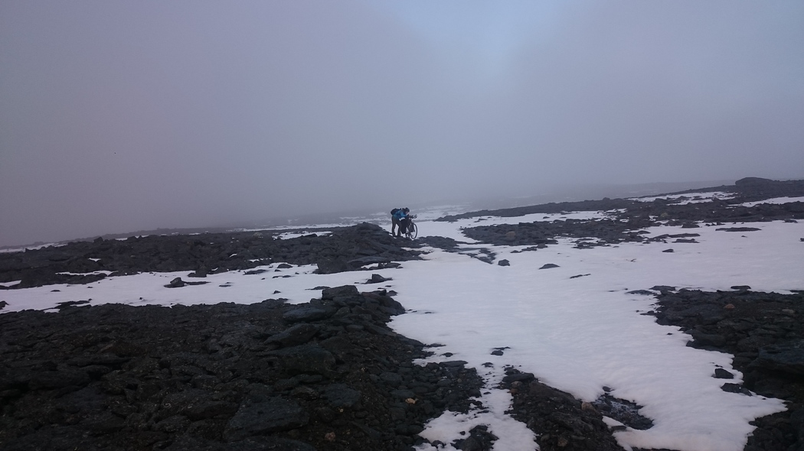

image:img/umb/20181016_123648.jpg[]

image:img/umb/20181016_131913.jpg[]

image:img/umb/20181016_143349.jpg[]

image:img/umb/20181016_144344.jpg[]

.Иногда велосипед утопал в снегу по самую кассету. Можно было оставить его таким образом припаркованным и немного отвлечься
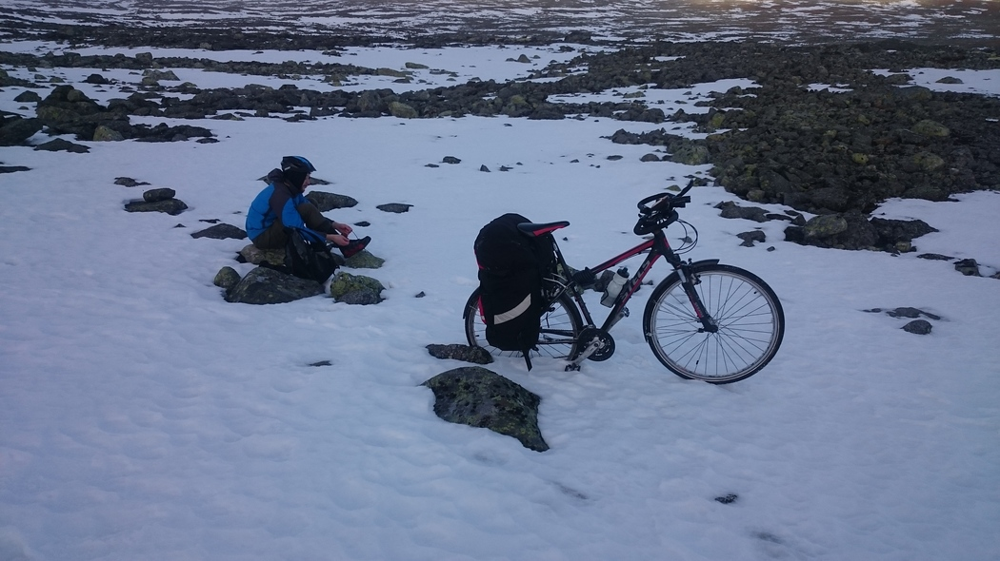

В районе истоков рек Тулбнюнуай и Чинглусуай снова прояснилось и мы продолжили наслаждаться далёкими
горными видами. Чуть обойдя вершину г. Аннвундасчорр, мы подошли к долине озера Сенгисъявр, а гора
тем временем озарилась вечерним солнцем.

image:img/umb/20181016_144906.jpg[]

image:img/umb/20181016_152843.jpg[]

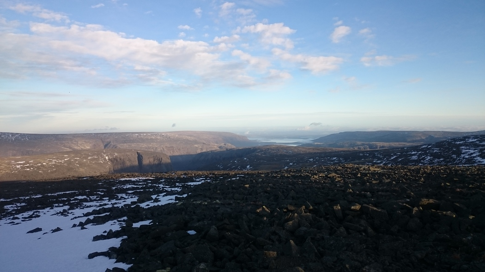

.Артефакты
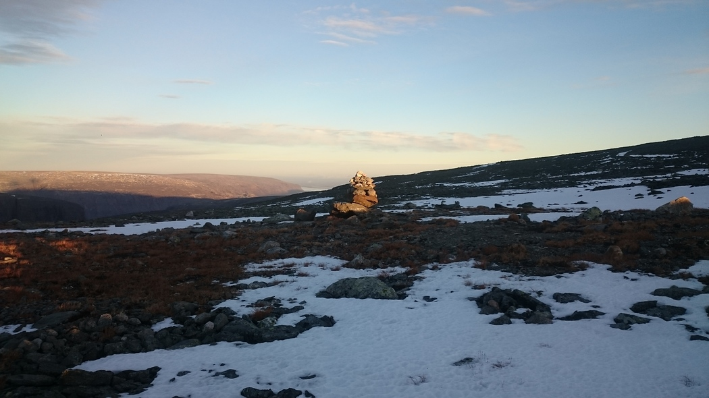

Маршрут далее пролегал через вершину г. Сенгисчорр высотой более 1100 м, сил идти было ещё
достаточно, но делать очередной высокий подъём, да ещё с велосипедом и поклажей, не хотелось.
Матёрый коллега по походам (https://sebram.livejournal.com/[sebram]) рассказывал полезные идеи для
сложных участков вроде навешивания лямок на велоштаны и перенос их на спину, а также про фиксацию
руля двумя стропами и толкание вела вперёд за багажник, но нам было жалко терять драгоценные минуты
света на эксперименты.

.Гора Сенгисчорр
image:img/umb/20181016_161935.jpg[]

Качество дороги оставляло желать лучшего, так что я предложил не идти в гору, а пройти напрямик мимо
озера к долине реке Тавайок, где было ближайшее место для удобной ночёвки. Но так как местность была
незнакомая, Виктор уговорил меня не рисковать в столь позднее время, и мы пошли на штурм.

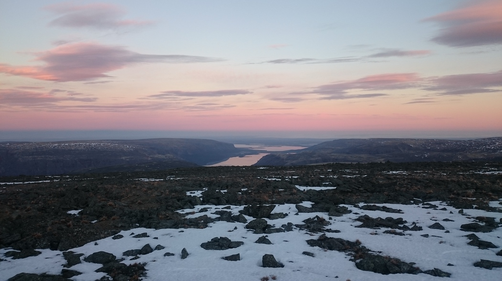

image:img/umb/20181016_171122.jpg[]

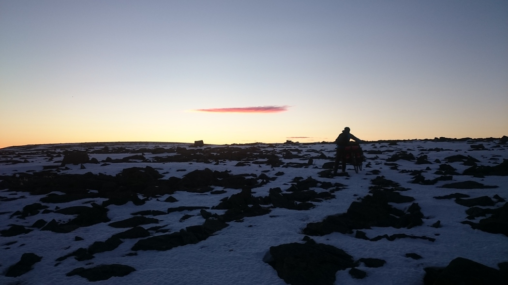

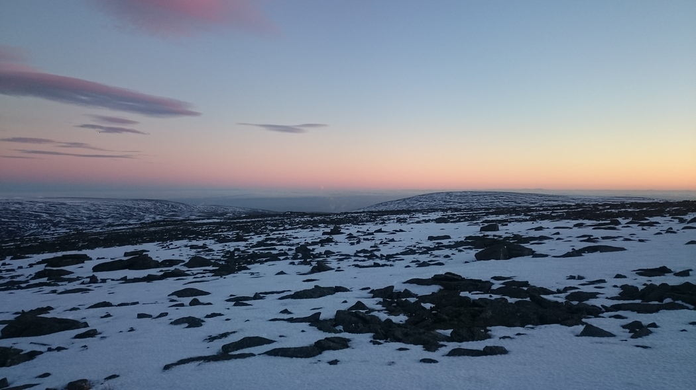

image:img/umb/20181016_172112.jpg[]

Подъём был довольно крутой, тяжёлый, на улице быстро темнело, мы изрядно устали, но, зайдя на
вершину, мы увидели обалденное небо и горы во время заката. Ярко красное небо между чёрными горами и
тёмными грузными облаками было похоже на Мордор, когда Фродо и Сэм уже видели его из леса. На
вершине был довольно сильный ветер, утепляться было уже нечем, и мы старались не останавливаться без
веской причины (единственными оправданиями были, конечно, только короткий отдых, перекус или чай).

image:img/umb/20181016_173538.jpg[]

.Луна и солнце
image:img/umb/20181016_175942.jpg[]

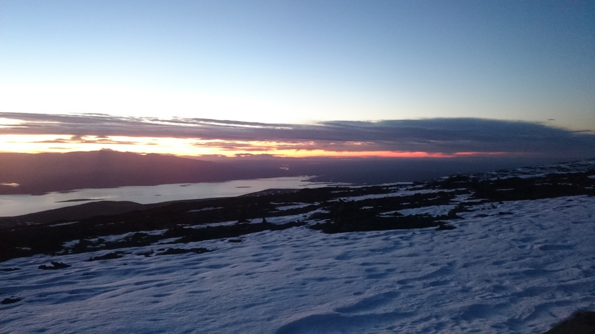

Спуск с горы был весьма необычным: после недолгих пологих склонов мы потеряли дорогу, да и темнота
спускалась быстро. Надев фонари, мы пытались следовать маршруту по навигатору, который то и дело
уводил нас со снежных заносов на поля больших и острых камней, идти по которым и так было довольно
опасно, а делать это с гружёным велосипедом -- тем более. Вскоре остался только свет фонарей: сумерки
сменились полной темнотой, в которой лишь виднелись очертания очень далёких гор и огоньки
расположенного у их подножья населённого пункта. Склон становился всё круче, я даже упал пару раз,
спускаясь по обледенелому снегу, к счастью, не на камни. Мы шли напрямик с горы ещё несколько
десятков метров то по снегу (в который ноги проваливались у одного по щиколотку, а у другого -- по
колено), то по камням, где провозить вел было тем ещё удовольствием. Попытки пройтись и найти с
фонарём дорогу не увенчались успехом, но в какой-то момент снег и камни стали покрываться ягелем
(кстати, его очень много в тех местах) -- и идти стало намного легче. В результате обнаружилась
заветная тропа. Ближе к подножью становилось теплее и снег сменялся пропитанной водой грязью из
песка и камней -- всё это местами с уклоном в 40°. Получился очень необычный и сложный спуск.
Дальше уже можно было ехать, мы добрались до реки и там заночевали. (Хотя Виктор предлагал мне
доехать до места следующего варианта ночёвки, ещё не представляя, какие прелести ждали нас впереди.)

== День 3 ==

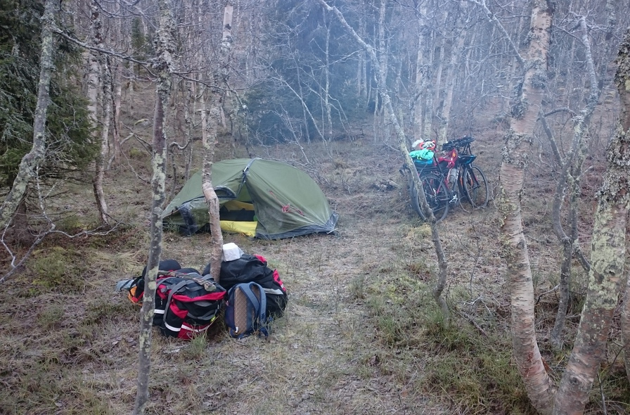

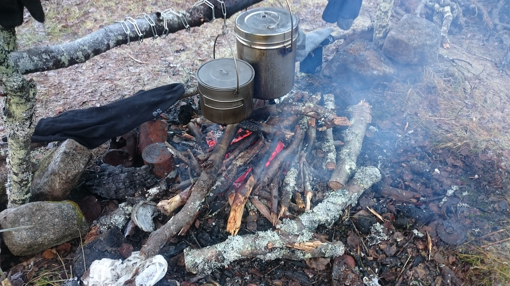

Утром третьего дня немного замёрзли (было ниже нуля, палатка и велосипеды покрылись инеем), встали
поздно, в районе 6:50, решили развести костёр: я сжёг пару таблеток сухого горючего --
безрезультатно. Со второго захода (и третьей таблетки) Виктор смог-таки разжечь дрова. Они были даже
не столько сырыми, сколько покрытыми замёрзшей влагой и инеем, в результате чего часть пламени
тратилась выпаривание. Совсем немного посушили носки, одни из которых сгорели, поели, запаслись
водой и отправились дальше. Дорога в долине становилась труднопроезжаемой, где-то опять спешивались,
но вскоре выехали на тропу из бугорков и стали разгоняться, оказавшись в итоге в крайне живописном
месте, с которого был виден лес, за ним -- озеро и покрытые снегом вершины гор.

.Атмосферная речка
image:img/umb/20181017_114842.jpg[]

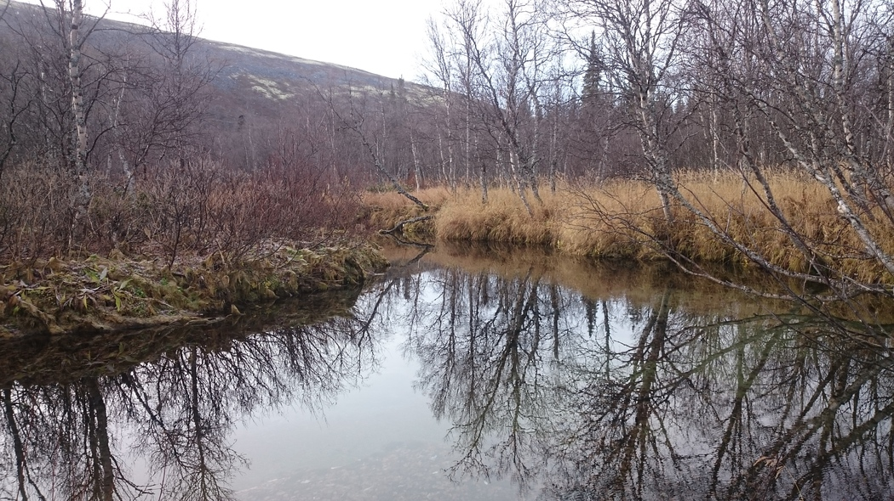

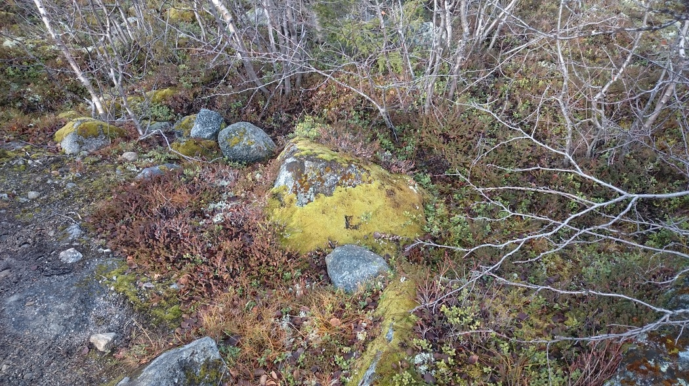

.На подъезде к Умбозеру
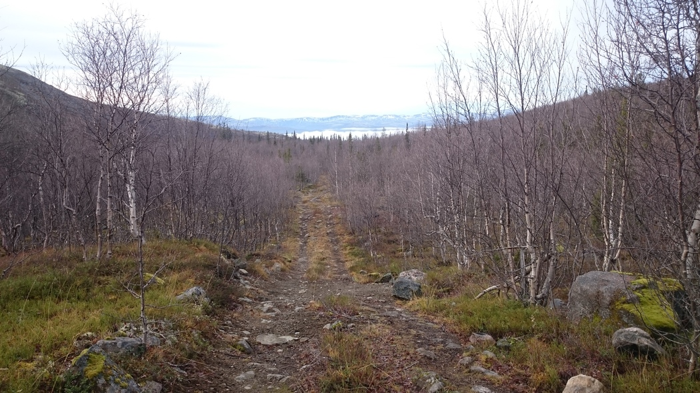

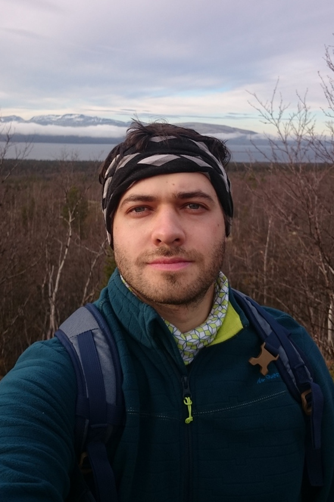

.Подмёрзшая гладь небольшого озера
image:img/umb/20181017_125557.jpg[]

.Вершины Хибин за Умбозером
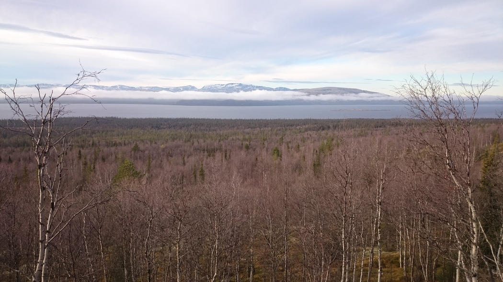

image:img/umb/20181017_130058.jpg[]

Немного посидели, побродили, наслаждались видами ясного дня и далёких пейзажей, а после -- поехали
вниз к идущей вдоль Умбозера дороге. Последняя была ничего, если бы не одно «но»: с первых же метров
мы наткнулись на большую лужу, которые потом ещё долго сменяли друг друга, перемежаясь с небольшими
речками и ручьями. Виктор любезно предложил мне свои велобахилы, узнав, что у меня даже не
трекинговые ботинки, а обычные кроссовки, пропитанные спреем от намокания. Остаток дня мы двигались
от лужи к луже и от реки к реке, преодолеваемым с разной степенью риска и временных затрат.

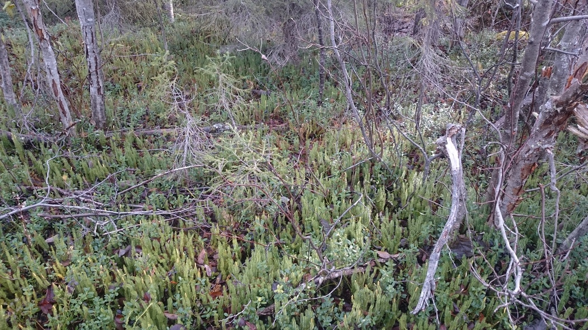

.Новый вид препятствий: лужи...
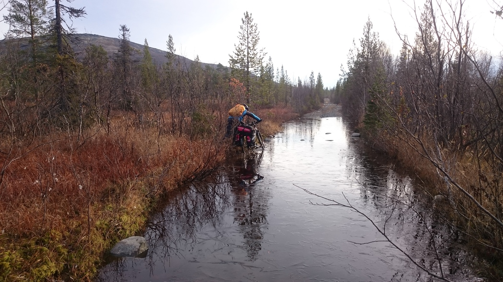

.\... и реки
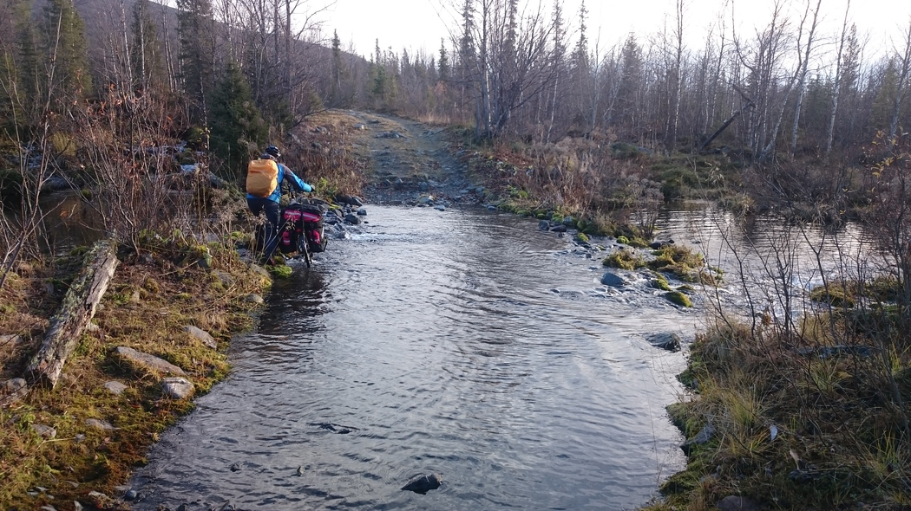

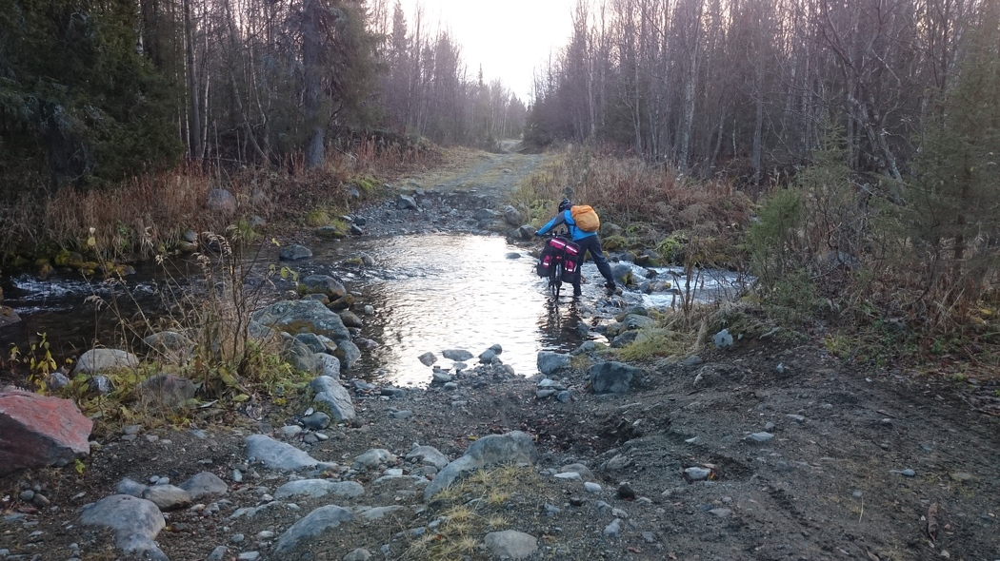

image:img/umb/20181017_142128.jpg[]

.Кто сказал, что река должна идти поперёк дороги??
image:img/umb/20181017_150720.jpg[]

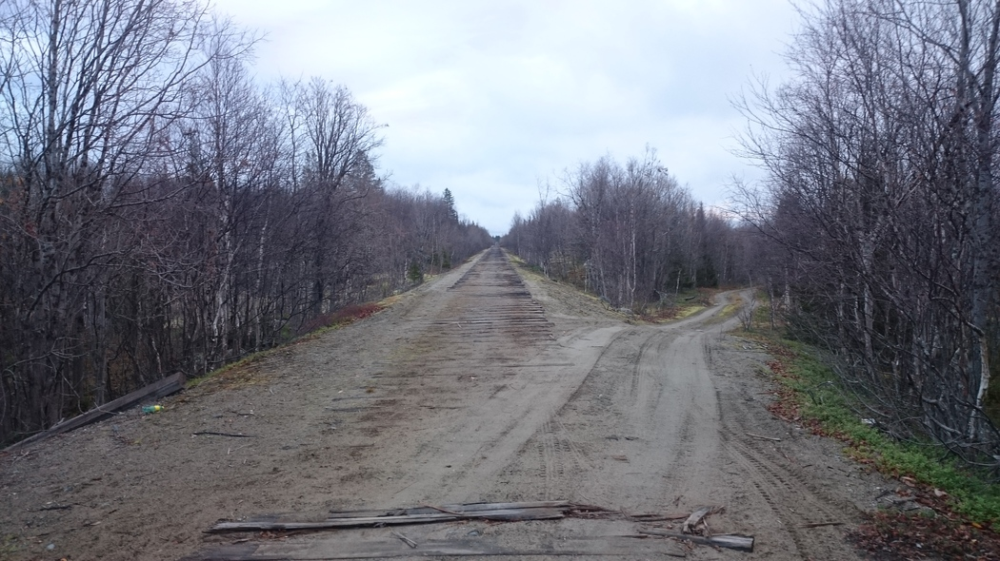

Вечер стал более пасмурным. Проезжая в одном месте недалеко от Умбозера, решили посмотреть на него:
размеры впечатляли. Тучи, ветер и волны продолжали нагонять ощущение северной суровости и уныния. На
дороге увидели несколько мёртвых мышей и стали придумывать всякие зловещие варианты будущих
приключений и опасностей.

.Умбозеро
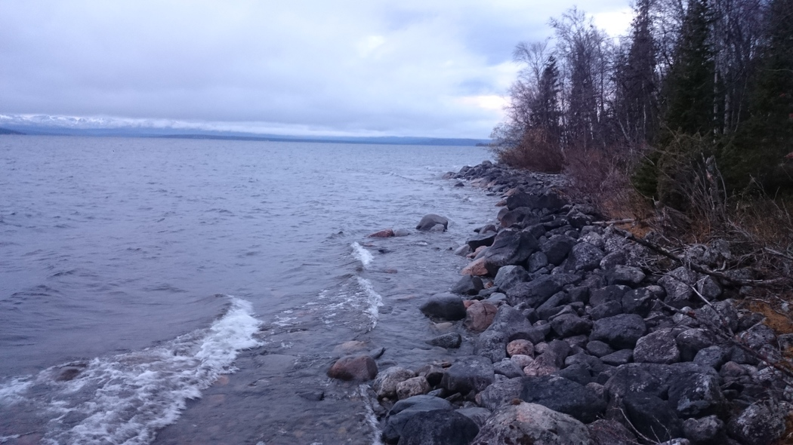

Время близилось к сумеркам, у меня было большое желание начать ставить палатку при свете, т.е. хотя
бы за полчаса до заката, но, проезжая мимо одного из удобных мест для ночёвки, друг каким-то образом
уговорил меня проехать ещё немного, и случилось вот что. На улице стало совсем темно, мы пересекли
несколько луж и отрезков, а следующая оказалась слишком глубокой для переезда по центру на скорости,
в результате чего Виктор изрядно намочил ботинки, зачерпнув в них воды. С этого момента ехать надо
было без промедлений, потому что ноги начали сильно мёрзнуть. И самая засада заключалась в том, что
следующие лужи стали непроходимыми без сапог: оба берега имели слишком мало тверди, где-то валялись
брёвна, но часто не на всю длину. Я понял, что выбора нет, снял бахилы, кроссовки и носки и пошёл
босиком. Потом обулся, доехал до следующей -- и по новой. Хотя вода и была покрыта льдом, особого
дискомфорта не чувствовалось. В какой-то момент решил идти, не разуваясь, и намочил кроссовки
снаружи. Так мы добрались до очередной реки, побродили по окрестностям; удобных мест для ночёвки не
нашлось, встали в лесу, где с трудом отыскали более-менее ровный пятачок для палатки, поели и легли
спать. Лес в тех местах в основном елово-берёзовый, голой земли в котором не видно: всё свободное
пространство (даже поверхности камней и поваленных деревьев) занято мхом, грибами и иногда ягодами.
Причём слой мха довольно толстый, порой он проседал сантиметров на 10–15.

Ночью я несколько раз просыпался и слышал, как дождь стучит по тенту палатки, что не добавляло
оптимизма двум парням с мокрой обувью и теперь уже без малейших шансов на костёр в сыром лесу.

== День 4 ==

К счастью, к утру дождь прекратился, но день выдался очень сырой и туманный. Вопрос с мокрой обувью
решили надеванием пакетов поверх сухих носков: было холодно, но сухо. В условиях сильного отставания
от графика и в контексте последних событий мы стали обсуждать дальнейшую тактику: параллельно нашей
дороге шла старая недостроенная железная, которая гарантированно не имела проблем с реками, лужами и
ручьями, но песок и шпалы позволяли двигаться по ней преимущественно пешком. Пару часов мы шли или
медленно ехали по железке, потом решили попробовать ехать по дороге, но так, чтобы не сильно
отдаляться от первой и можно было вернуться.

.Старая железка над очередной рекой
image:img/umb/20181018_085724.jpg[]

.«Давление и время», как говорил Энди Дюфрейн
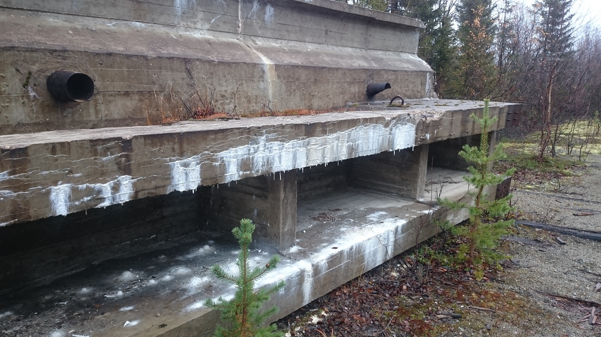

.Лёгкое недовольство моими частыми съёмками
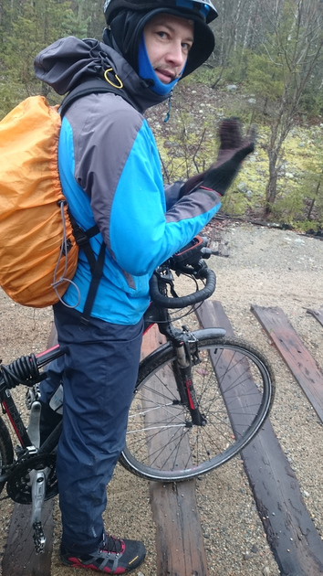

.Вот уж действительно: ни пройти ни проехать
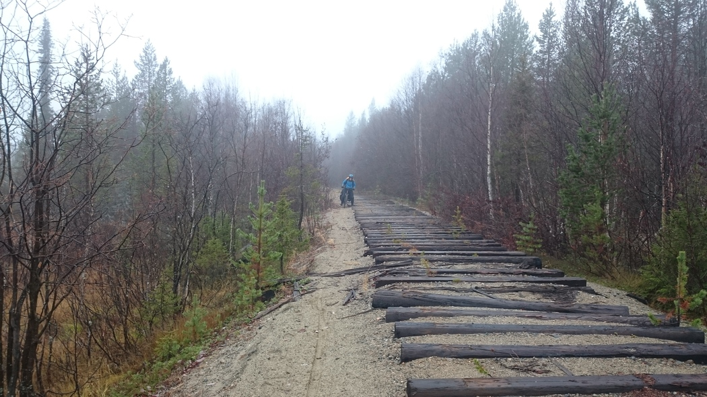

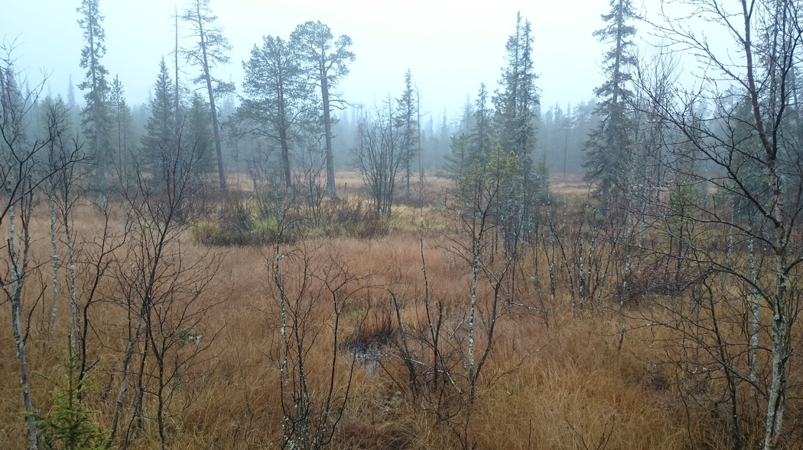

К счастью, сложных луж уже не было, а большинство рек мы переходили по железке. А в свободное время
гадали: как же там ездят на машинах: следы были видны чуть ли не на протяжении всей дороги. Погода
добавляла уныния и заброшенности тем местам. Насладились им около одного исключительно атмосферного
мостика через речку, на другой стороне которого было оставленное прошлыми путниками прямо посреди
дороги кострище, бутылки, резина, отрезанная от сапогов. Видя такую картину не в первый раз, мы
представили, насколько всё-таки суровы наши дороги, что даже суровые северные мужики, добравшись на
внедорожниках до этих мест, понимали всю безысходность своего положения и вместо продолжения пути
просто разводили костёр прямо перед лужей или таким вот мостом, выпивали с горя -- и ехали обратно. Я
тогда ещё подумал, что нашей стране можно не опасаться захватчиков: ни один высокоразвитый народ не
будет способен осознать, как, когда и на чём передвигаться по этой территории. Как говорил герой
одного известного фильма, «В этом смысл, в этом наша стратегия!»

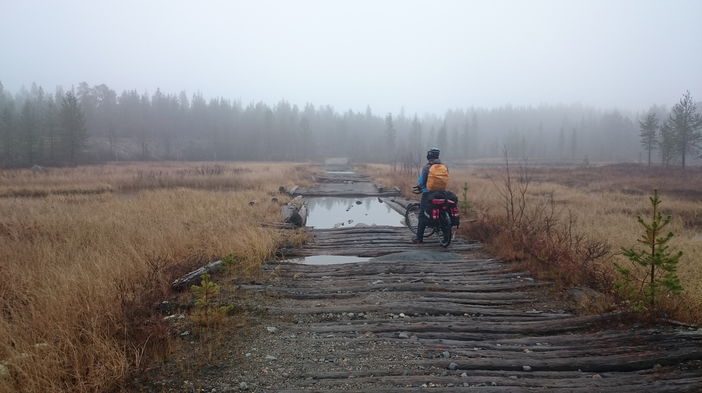

image:img/umb/20181018_100632.jpg[]

//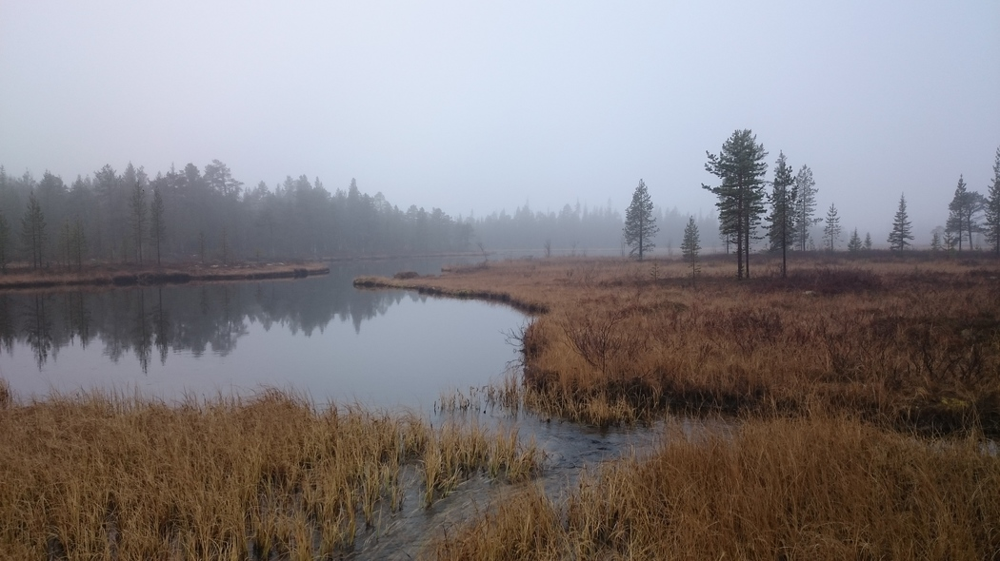

image:img/umb/20181018_100902.jpg[]

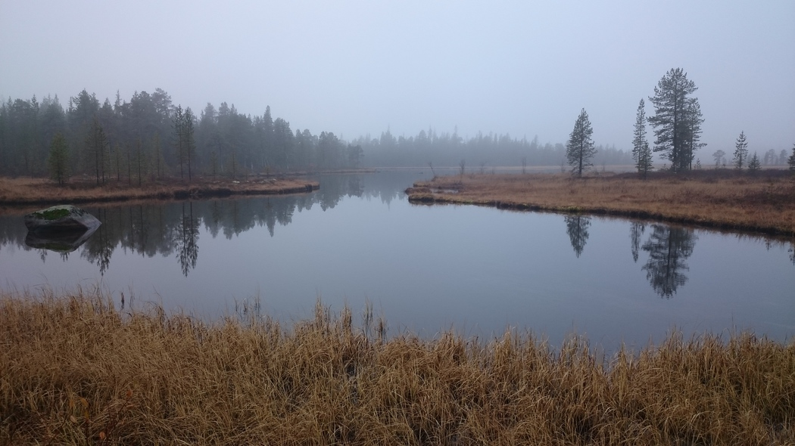

image:img/umb/20181018_101420.jpg[]

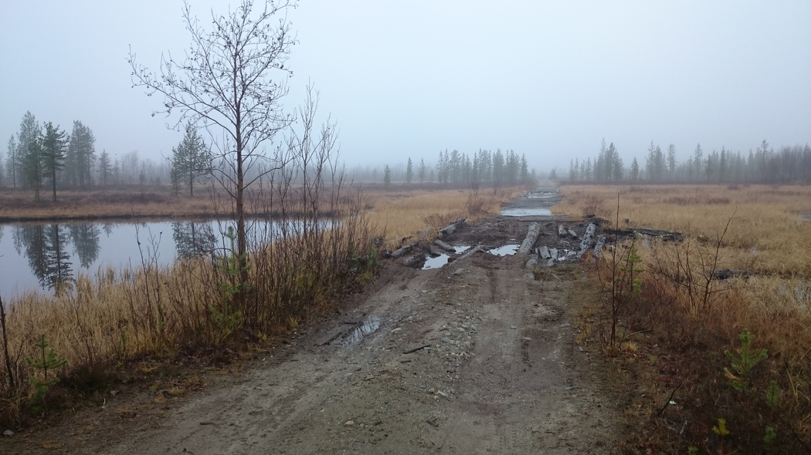

.«Рельсы, рельсы, шпалы, шпалы...» Хотя, рельсов уже давно нет
image:img/umb/20181018_104652.jpg[]

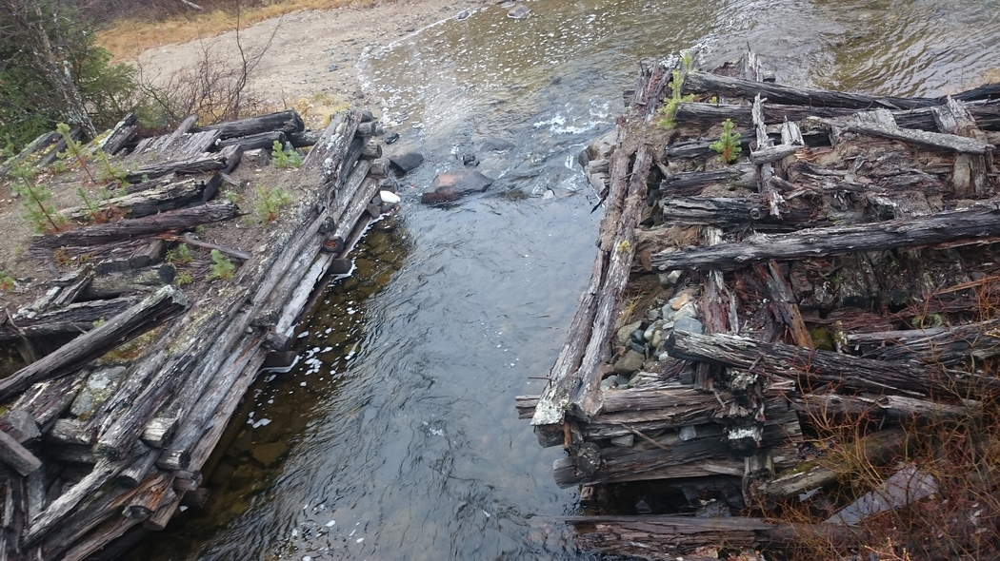

Позже лужи почти закончились и начался другой вид грунта -- сырой суглинок: вот тут-то я и пожалел,
что сменил цепь прямо перед поездкой. От смазки, конечно, сразу ничего не осталось, грязь
моментально распределилась по цепи, кассете и переключателям, стали слышаться трения и шуршания.
Настроение омрачило ещё ощущение предболезненного состояния после вчерашней ночной гулянки по
полузамёрзшим лужам, горло побаливало, и Виктор даже пытался сломить мою волю, предлагая таблетки,
но я выстоял, помня, что он наотрез отказался от своей доли взятого с собой чеснока, и употреблял
его за двоих при первой возможности. На остановке для перекуса мы увидели первых за тот день
животных: пара птиц, купающихся в луже, которые, видимо, совсем не привыкли к другой живности и
почти нас не боялись. Надо отметить, что, не считая десятка птиц, за всю дорогу из дикой живности
нам только один раз попались мыши.

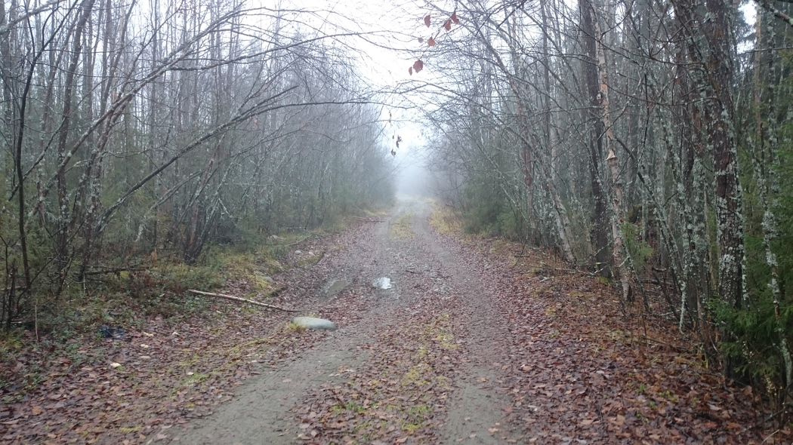

image:img/umb/20181018_114141.jpg[]

.Мост, построенный по уникальному проекту
image:img/umb/20181018_135146.jpg[]

image:img/umb/20181018_135543.jpg[]

image:img/umb/20181018_142401.jpg[]

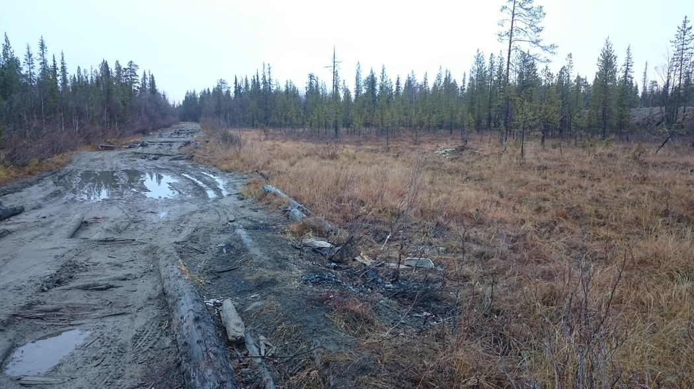

.Суглинок
image:img/umb/20181018_144046.jpg[]

Незадолго до заката мы ехали по довольно убитой дороге, приправленной брёвнами -- то разбросанными в
хаотичном порядке, то сложенными в виде низколежащих укреплений; однако водные препятствия, если и
встречались, оказывались такой халявой, что мы просто смеялись им в лицо.

Во второй половине дня настроение улучшилось, на закате сделали очередной привал и поехали с
Виктором (который теперь уже согласился с небезынтересностью идеи приезжать к месту ночёвки
засветло) к ближайшему пункту в районе речки Сейда. Это был первый раз, когда мы нашли стоянку в
сумерках, а не кромешной темноте. :)

Было видно, что те места пользуются спросом среди местных, т.к. по дороге нередко попадались знаки в
виде подвешенных на верёвочках пустых пивных банок, а в районе последнего места на колодезных
кольцах вообще стояла бутылка из-под машинного масла. Приготовив еду, закинув вещи в палатку и
накрыв велы тентом, мы в первый раз спокойно посидели и потрындели о том о сём, глядя на безупречно
чистое небо, усеянное звёздами, вдыхая приятный, пахнущий лесом воздух и понимая, что никто нас
здесь не потревожит.

image:img/umb/20181018_144230.jpg[]

.На заднем плане видна идущая параллельно железная догора. К сожалению, её отделяет болото, пройти которое можно разве что в рыбацких сапогах
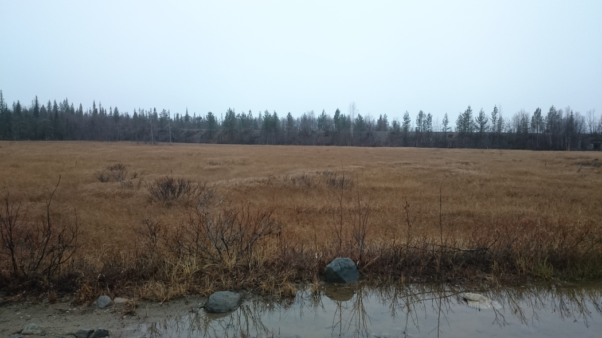

.Эхх...
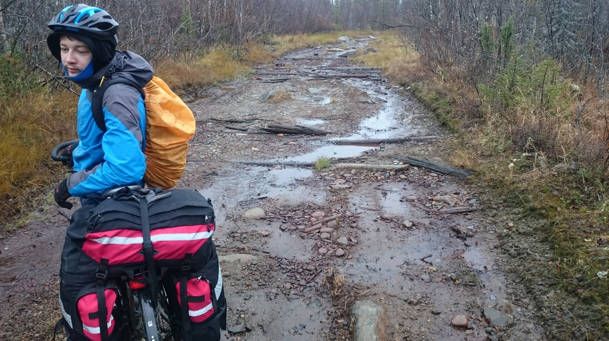

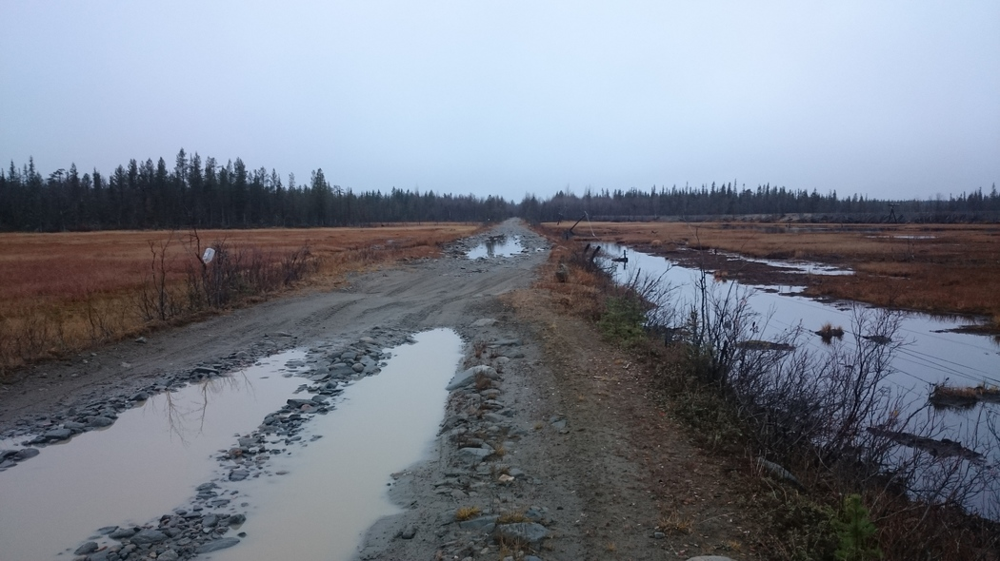

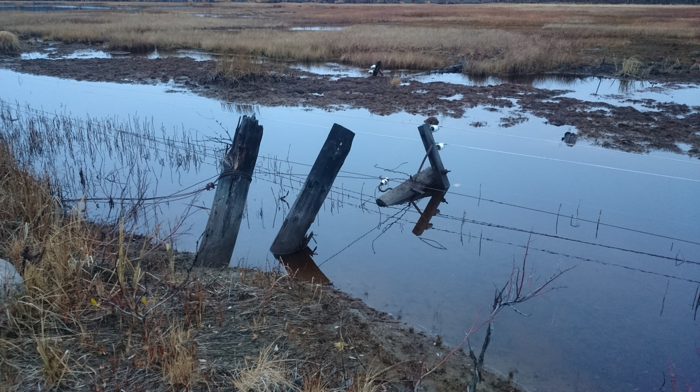

== День 5 ==

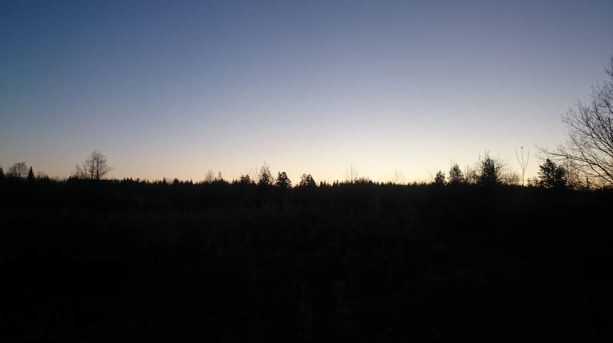

На следующий день встали рано, утро выдалось особенно морозное и ясное: трава хрустела под ногами,
велосипеды покрылись инеем, а палатка -- местами и льдом. Укутавшись во всё, что имелось, мы быстро
согрелись, хотя обувь, конечно, ещё не высохла и подмёрзла, отчего ноги долго не согревались. Выходя
на дорогу, природа поставила нам задачу: вчерашняя грязь замёрзла на наших конях, если друг без
проблем разработал движущиеся элементы, то у меня оказались заблокированы все узлы нижней части,
кроме педалей и тормозов: цепь с трудом гнулась даже в месте, где свободно висела. Пришлось вдвоём
расковыривать замёрзшую глину отвёрткой. Спустя полчаса или больше, привод пришёл в движение, хотя
ещё несколько часов функционировала только пара-тройка скоростей из 27.

.Иней
image:img/umb/20181019_074211.jpg[]

image:img/umb/20181019_084109.jpg[]

.Лес наполняется солнцем
image:img/umb/20181019_085133.jpg[]

Выехав на дорогу, я решил немного раздеться, и тут мы услышали шум какого-то мотора. Только через
пару минут, мы, наконец, увидели, на каких машинах ездят в этой глуши: это был внедорожник с
широкими колёсами выше наших велосипедов. Внутри сидели два мужика с собакой, которые настолько
суровы, что посмотрели на нас, как на обычных прохожих в Москве: будто встретили уже десятка два
таких же велосипедистов. Без лишних эмоций сказали, что дорога дальше будет нормальная, и мы
разъехались в разные стороны.

.«Сколько можно фоткать?!!»
image:img/umb/20181019_094555.jpg[]

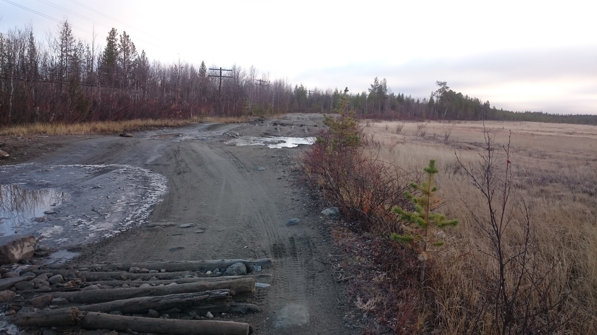

.Укрепления и элементы магистрали
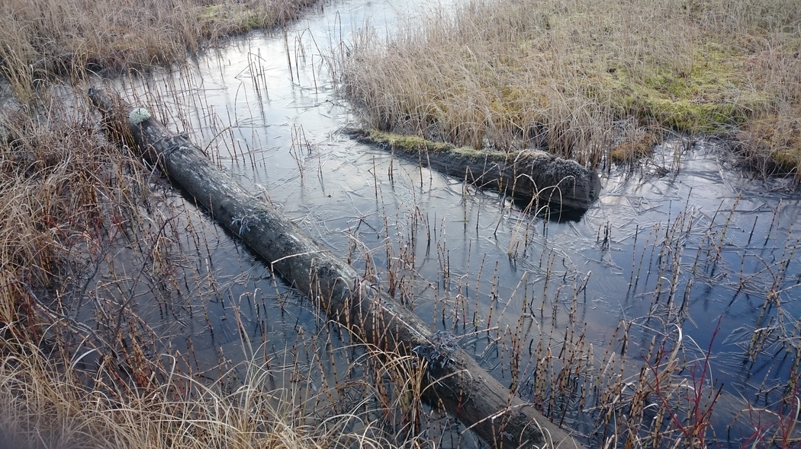

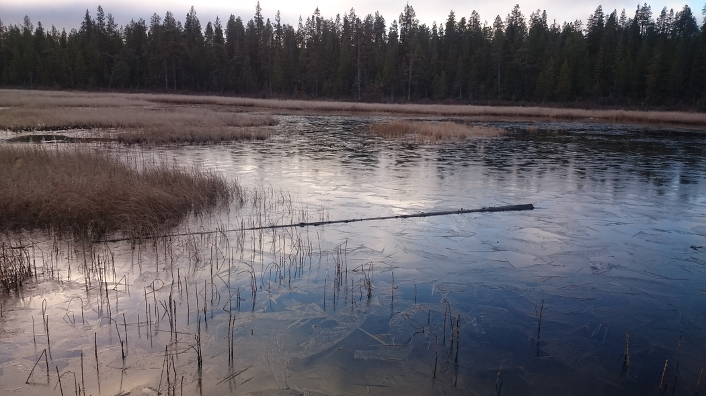

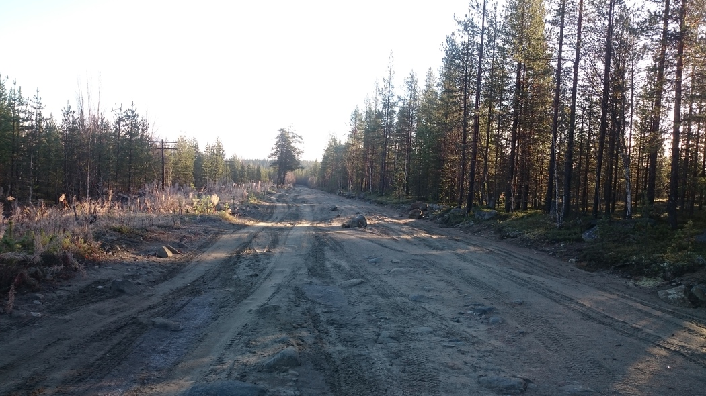

День был солнечный, что дало возможность прикрепить две пары носков поверх велоштанов, где они в
итоге за следующие несколько часов хорошо высохли. Дорога действительно оказалась ещё более простой
и с новым типом покрытия: такая же вчерашняя грязь, но замёрзшая. Ехать по ней было даже сильно
проще, потому что велосипед не увязал. В итоге, на всём маршруте у меня получилось доминировать над
гибридом Виктора только пару часов предыдущего дня, проезжая мокрый песок и суглинок.

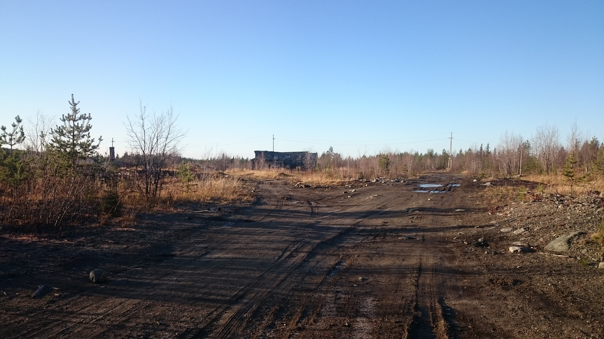

image:img/umb/20181019_112903.jpg[]

image:img/umb/20181019_122333.jpg[]

Вскоре выехали на уплотнённую каким-то связующим составом грунтовку, где стали встречаться
«буханки», «жигули» и даже иностранные паркетники, а вскоре и вовсе начался асфальт. Торопиться было
некуда: вчера утром мы поняли, что ехать придётся по самому короткому варианту маршрута из-за
излишне оптимистично рассчитанных планов на день в горах и неожиданные дороги с лужами, так что горы
Хибины видели только с горизонта. Остановились посмотреть большую реку Умба, после чего свернули
направо, чтобы доехать до отмеченного на карте «зашейка на Умбозере». Дорога там была
преимущественно из гравия, довольно разбита, с крутыми перепадами высот, при этом по ней проезжало
много для тех мест машин, а один раз навстречу ехал вообще «Камаз» с длинным прицепом. Видимо
водитель решил заехать порыбачить. :)

.Река Умба
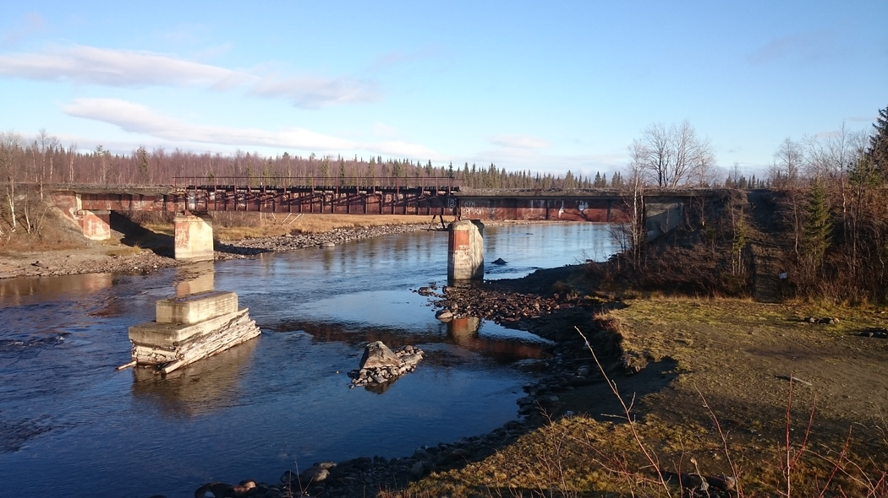

.Она же
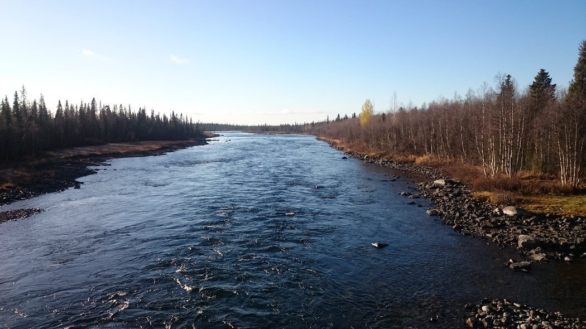

image:img/umb/20181019_124620.jpg[]

.Съехали с шоссе и следуем вдоль реки
image:img/umb/20181019_125943.jpg[]

Проехали стоянку с машинами (рыбаки или ещё кто), и выяснили что зашеек -- это заимка со шлагбаумом,
там не заночуешь. До вечера было ещё долго, останавливаться в окружении такого количества людей
совсем не хотелось, поехали обратно. На пути к зашейку Виктор сообщил, что колодки его v-break'ов
совсем стёрлись, и обратно он нередко тормозил подошвой ботинка.

image:img/umb/20181019_134043.jpg[]

.Муравейник
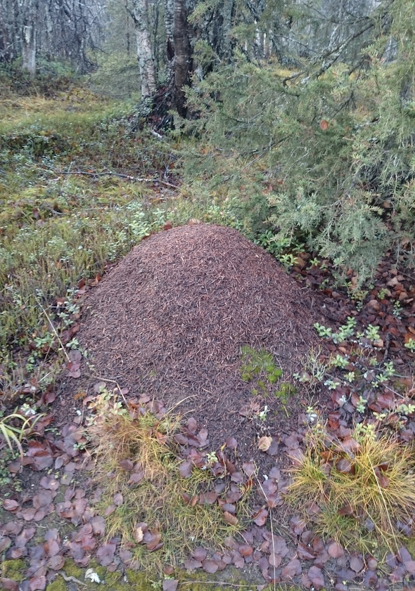

Когда вернулись на шоссе, сделали привал с целью подкрепиться и поменять колодки, солнце стало
садиться, и мы двинулись дальше. Из мест, что мы проезжали, не находилось того, которое бы нас
устроило, и так мы доехали до реки Ловчоорйок, опять доезжая последние километры в сумерках и
темноте, а незадолго до этого проскочив мимо автогрейдера, который, было, пытался нас догнать и
задать жару, но мы оторвались. :)

.Вершины Хибин на заднем плане...
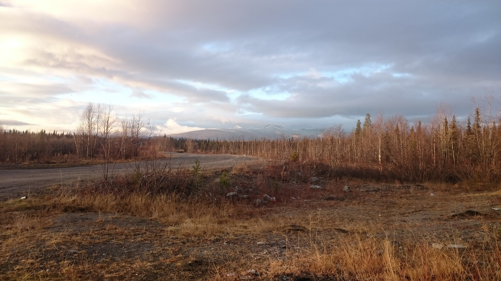

.\... и облаков над ними
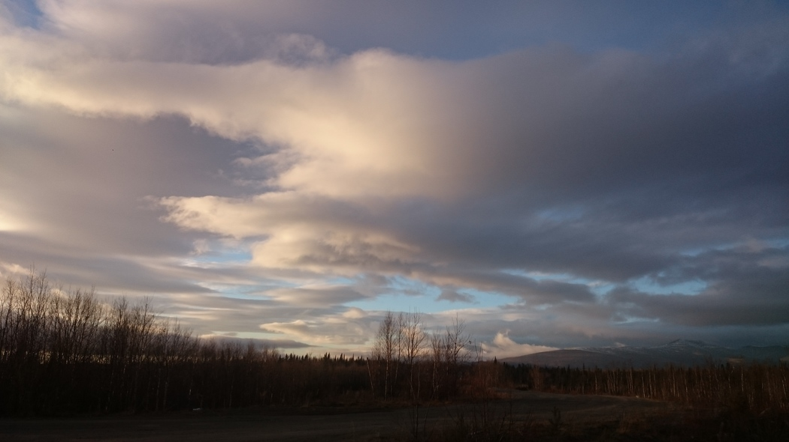

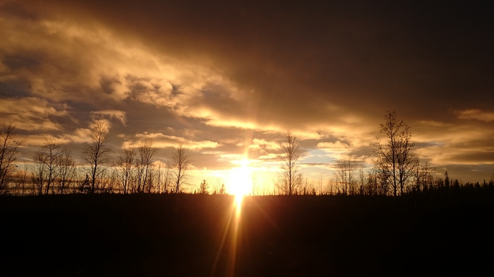

image:img/umb/20181019_162800.jpg[]

image:img/umb/20181019_165238.jpg[]

Место для палатки искали в лесу долго, ничего ровного найти не получалось. К тому же встали в
нескольких десятках метров от крупного шоссе, шум от машин которого не прекращался ни на минуту.

== День 6 ==

Утром было прохладно и пасмурно, а выйдя на шоссе, мы увидели такой густой туман, какого, пожалуй,
раньше ещё не встречали. Остаток дня был всё таким же туманным и пасмурным, чёрные камни, старые
автобусные остановки добавляли антураж безысходности, мимо нас в основном проносились грузовики. Так
мы добрались до города Апатиты, заехали на вокзал, согрелись, высохли и стали ждать следующие 9
часов нашего обратного поезда до Санкт-Петербурга.

image:img/umb/20181020_101911.jpg[]

image:img/umb/20181020_101923.jpg[]

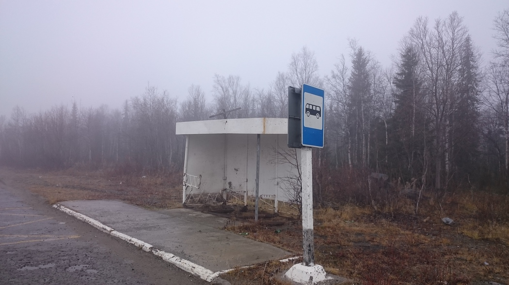

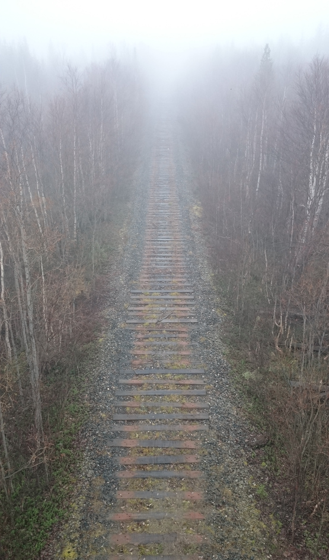

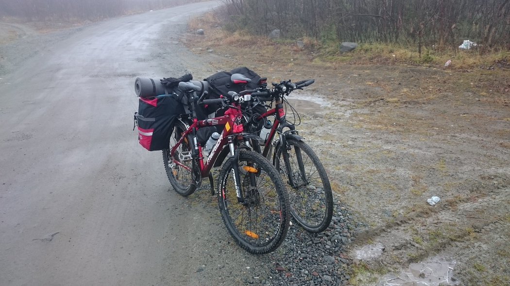

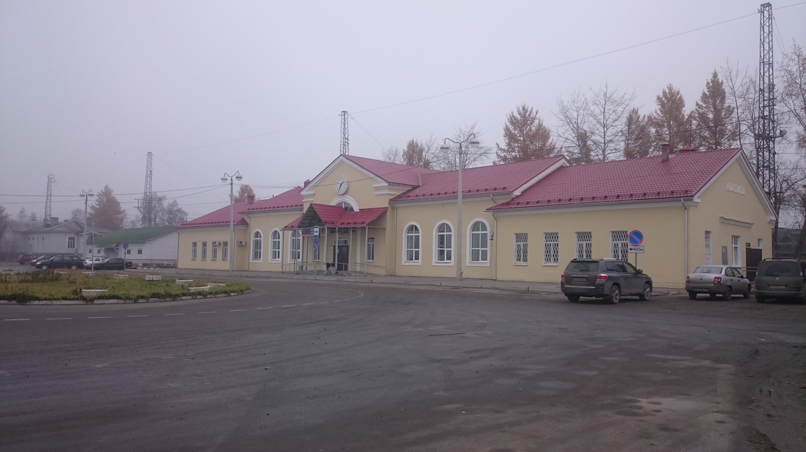

В поезде разговорились с соседями, заинтересовавшимися двумя путешественниками, у которых Виктор
сумел добыть некоторые полезные сведения относительно любопытных мест севернее Мурманска. Возможно,
когда-нибудь туда состоится ещё одна поездка. Эта же получилась крайне увлекательной и насыщенной в
разных смыслах этого слова, так что планы на будущие мероприятия мы стали обсуждать ещё по дороге к
тёплому и сухому дому.

[NOTE]
====
[small silver]__Всё оригинальное содержимое этой страницы доступно без каких-либо ограничений как
относящееся к https://creativecommons.org/publicdomain/mark/1.0/[общественному достоянию]. +
All original content of this page is in the
https://creativecommons.org/publicdomain/mark/1.0/[public domain]. No rights reserved.__
====

// comments: discus.com
++++

<noscript>Please enable JavaScript to view the
<a href="https://disqus.com/?ref_noscript">comments powered by Disqus.</a></noscript>
++++
